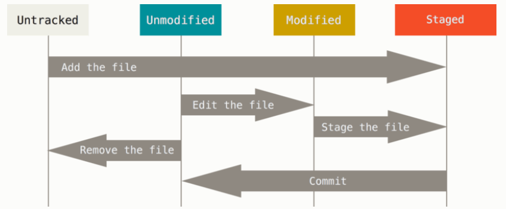

`
# General commands

## add git. to repository
`git init`

## to the stage area
`git add .`

## commit changes with message 
`git comit -m "type you changes"`

## skpping on the staging area 
`git commit -a -m "your note"`


## view status
show the state of the folder



`git status`

### short status
`git status -s`


## checkout **each** file changed
`git checkout`

## view the diffrence between now to the last commit
`git diff`
or
`git diff <filename>`

## view the diffrence between the stage files to the last commit
`git diff --staged`

## view the diffrence between the cached files to the stage files
`git diff --cached`


## removing files

`rm PROJECTS.md`
If you simply remove the file from your working directory, it shows up under the “Changes not staged for commit” **(that is, unstaged)** area of your git status output


`git rm PROJECTS.md`
To remove a file from Git, you have to remove it from your tracked files (more accurately, remove it from your staging area) and then commit.


## remove all the files that end with ~
`$ git rm \*~`

## remove all the files inside log directory with .log extension
`  $ git rm log/\*.log`


## moving files, the same as removing
`$ git mv file_from file_to`


2.3 viewing the commit history
## see all the versions
`git log`


## see whats happend in each commit
`$ git log -p -2`


# 2.4 Git Basics - Undoing Things
## redo one commit back
`$ git commit --amend`

**important, while you run this line, git used the staging file for the next commit**

## Unstaging a Staged File
`$ git reset HEAD filename`

the chosen file, will back to be unstage.


# 2.5 Git Basics - Working with Remotes
to see the remote name

`$ git remote`


output: origin

## show the fetch url and the push url

```
$ git remote -v
origin	https://github.com/schacon/ticgit (fetch)
origin	https://github.com/schacon/ticgit (push)
 ```
it could look like this    
```
$ git remote -v
bakkdoor  https://github.com/bakkdoor/grit (fetch)
bakkdoor  https://github.com/bakkdoor/grit (push)
cho45     https://github.com/cho45/grit (fetch)
cho45     https://github.com/cho45/grit (push)
defunkt   https://github.com/defunkt/grit (fetch)
defunkt   https://github.com/defunkt/grit (push)
koke      git://github.com/koke/grit.git (fetch)
koke      git://github.com/koke/grit.git (push)
origin    git@github.com:mojombo/grit.git (fetch)
origin    git@github.com:mojombo/grit.git (push)
```
## Adding Remote Repositories

 `git remote add <shortname> <url>`


## 3 ways to get data from remote repository

### git clone
automatically sets up your local master branch to track the remote master branch (or whatever the default branch is called) on the server you cloned from.
`$ git clone <remote>`


### git pull
 git pull generally fetches data from the server you originally cloned from and automatically tries to merge it into the code you’re currently working on.

`$ git pull <remote>`


### git fetch
The command goes out to that remote project and pulls down all the data from that remote project that you don’t have yet. After you do this, you should have references to all the branches from that remote, which you can merge in or inspect at any time.
`$ git fetch <remote>`


## Pushing to Your Remotes

git push <remote> <branch>
`$ git push origin master`

## Inspecting a Remote
If you want to see more information about a particular remote, you can use the git remote show <remote> command.

`$ git remote show origin`

## Renaming and Removing Remotes

renaming

```
$ git remote rename pb paul
$ git remote
origin
paul
```

removing
`$ git remote remove paul`


# create a remote repositry in Github
## push repositry to github

1. create repository in git hub
2. copy the repository link
2. write in the command line:
   git remote (remote repository) -u origin (the repositry name, theoreticly it could be anything but usually peope set it to "origin")
4.  git push -u origin master
  then it will take some time and upload your files to github.

# git ignore
1. create a git ignore file simply with the command line 
touch git ignore
2. open the gitignore
3. write inside it all the things you want to ignore

## basic syntax:
line that start with #, count as a comment
```
# ignore all .a files
*.a

# but do track lib.a, even though you're ignoring .a files above
!lib.a

# only ignore the TODO file in the current directory, not subdir/TODO
/TODO

# ignore all files in any directory named build
build/

# ignore doc/notes.txt, but not doc/server/arch.txt
doc/*.txt

# ignore all .pdf files in the doc/ directory and any of its subdirectories
doc/**/*.pdf
```

## important to know 
inside Github there's a repositry called gitignore, inside there's a prime build in template, to ignore, recomend swift.gitignore

## clone repositry from github
git clone <repository link>

## branches
